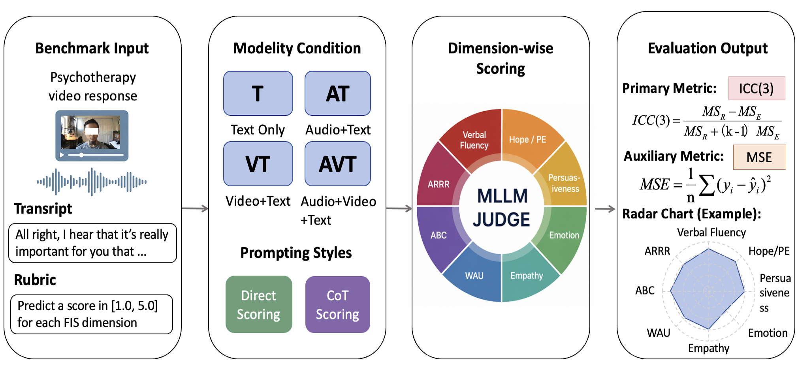

# MIS-Bench: Benchmarking Multimodal LLMs for Psychotherapeutic Interpersonal Skills Assessment

## Abstract
Multimodal large language models (MLLMs) are increasingly used as evaluators, yet their reliability in expert-based professional assessment remains unclear. We study this challenge through psychotherapeutic interpersonal skill assessment and introduce \textbf{MIS-Bench}, a Multimodal Interpersonal Skills (MIS) benchmark of 996 psychotherapy response videos annotated across eight Facilitative Interpersonal Skills dimensions. Evaluating nine MLLMs across modality and prompting settings, we find that current models remain far from reliable expert agreement, with modest performance, unstable multimodal gains, and limited benefits from reasoning-based prompting. To mitigate this gap, we propose \textbf{MIS-RAFT}, a regression-aware fine-tuning method inspired by RAFT and adapted to continuous one-decimal interpersonal skill scoring. MIS-RAFT addresses the mismatch between autoregressive token prediction and scalar expert scoring, substantially improving alignment with human ratings. Overall, MIS-Bench exposes the gap between general multimodal capability and expert-level interpersonal judgment, while MIS-RAFT offers a promising path toward more reliable model-based assessment.

## Overview


## Data Release and Privacy

In accordance with ethical requirements and participant privacy protection, we do not release the original raw video recordings. Instead, the original recordings are converted into de-identified feature representations across face, audio, and text modalities. This strategy preserves behaviorally meaningful signals for multimodal FIS assessment while removing directly identifiable facial and vocal information.

The visual stream is represented by structured facial behavior descriptors rather than raw face images. We use [OpenFace 3.0](https://github.com/CMU-MultiComp-Lab/OpenFace-3.0) to extract complementary signals, including AU occurrence and intensity, 98-point facial landmarks, gaze directions, and detection confidence.

The audio stream is converted into abstract acoustic representations to capture affective delivery and speaking style while avoiding direct exposure of speaker identity. We extracted acoustic features with librosa, including 80-dimensional log-Mel spectrograms and 13-dimensional MFCCs, and contextualized speech representations with a pretrained Wav2Vec 2.0 model, which yields 768-dimensional sequence features. In addition, we computed segment-level prosodic descriptors, including pitch statistics, energy variation, pause patterns, spectral characteristics, and voice-quality-related measures.

For the language modality, we release transcript words, preserving the semantic content of therapist responses.


## Dataset Structure

Each sample contains synchronized multimodal features derived from a therapist response clip, together with FIS scores annotated by trained human raters. `T` denotes the number of time steps aligned to the facial/acoustic feature streams, and `N_word` denotes the number of transcript words.

| Modality | Feature | Shape / Type |
| --- | --- | --- |
| Face | Action units | `T x 8` |
| Face | Facial landmarks (98 points, x/y) | `T x 196` |
| Face | Gaze direction | `T x 2` |
| Face | Detection confidence | `T x 2` |
| Audio | Wav2Vec 2.0 frame embeddings | `T x 768` |
| Audio | Prosody (pitch, energy, pauses, spectral statistics) | `T x 15` |
| Audio | Log-Mel spectrogram | `T x 80` |
| Audio | MFCCs | `T x 13` |
| Text | Transcript words | `N_word` |
| Label | FIS subscale scores | `8` continuous scores in `[1, 5]` |

---

## MIS-RAFT

MIS-RAFT fine-tunes `Qwen/Qwen2.5-VL-7B-Instruct` with LoRA and a custom regression loss. It requires Python >= 3.10 and an NVIDIA CUDA GPU for 4-bit `bitsandbytes` training/inference.

Setup:
```bash
conda create -n misraft python=3.10 -y
conda activate misraft
pip install -U pip
pip install -r requirements.txt
```

Run:
```bash
cd MIS-RAFT
python pipeline_finetune_raft.py
python pipeline_inference.py --adapter_path ./output --output_csv finetune_raft.csv
python evaluation.py
```
